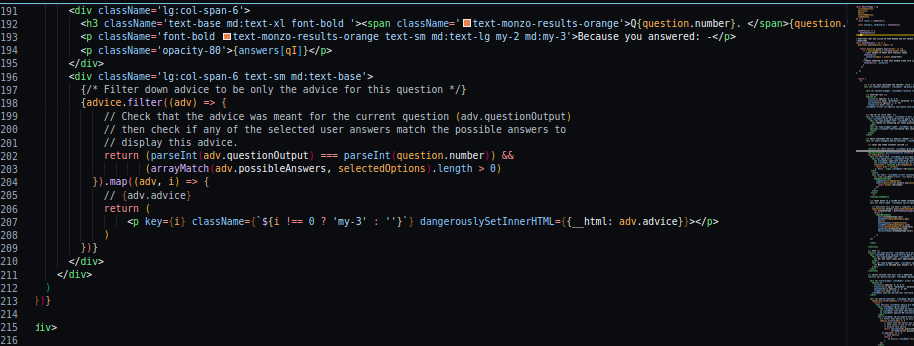

# Monzo Budgeting Quiz App

https://monzo-budget-tool.vercel.app/

Welcome to the Monzo Budgeting App. I made this application to alleviate some of the strains and anxieties people are facing with the cost of living crisis in the UK.

The budgeting tool asks a series of questions before prompting users to provide thier average monthly outgoings across a range of categories.

The user is finally taken to a results page where thier spend amounts are broken down and compared with the national average for each category. This data visualistion allows users to effectively identify areas in which they might currently be overspending.

The user is then provided with a series of weighted responses (financial tips / advice / links) based on thier answers to questions. The app identifies both problematic and positive spend behaviour, providing advice and signposting to external services for those that need it and encouragement and positive reinforcement for those that know how to budget and save.

---

FRONT END UI:

- Fully re-usable React - Components.

- Styled using Tailwind CSS.

- Routing handled with Next.JS native Page feature.

- Dynamic Pages and Conditional Rendering with persistent Progress Bar.

- PAGES: HOME, QUESTIONS, SLIDERS, RESULTS.

- Transitions Handled with Framer Motion.

- Responsive design.

---

INTERACTIONS AND ACCESSIBIILTY:

- Accessible to screen readers.

- Appropriate levels of contrast and font sizing.

- Sliders and buttons are tab-indexed making them accessible from the keyboard.

- Good page load times

---

Data Visualisation:

- Various ways of user interaction throughout to keep the user entertained; questions, sliders.

- SLiders where customised from the react sliders package. The package only provides basic sliders and it was a lot of work customising them to have unique tooltips etc

- The spend breakdown chart comes from Chart.js. This was also customised to fit the style guidelines of the App.

---
